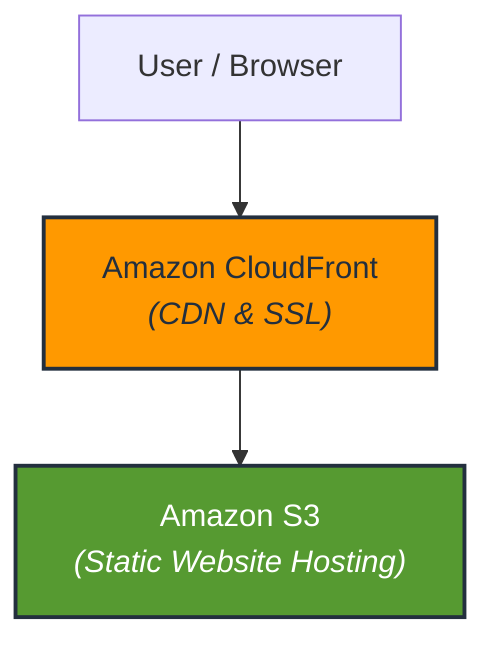
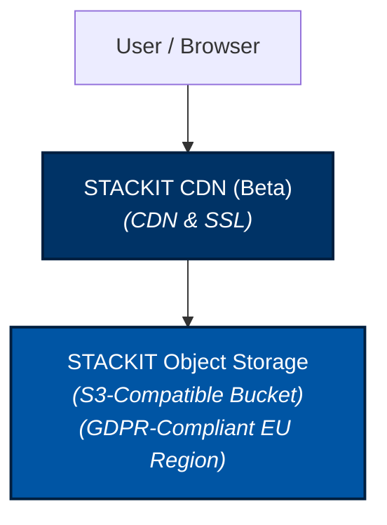

<div align="center">
  
  <h1>AWS to STACKIT: A Static Website Migration </h1>
  <p>
    
    
    
    
  </p>
  <hr/>
</div>

If you have built or managed a web project over the last decade, you are likely familiar with the standard AWS pattern: host static assets (HTML, CSS, JS) in an Amazon S3 bucket and place Amazon CloudFront in front as a Content Delivery Network (CDN). It is efficient, cost-effective, and widely adopted.

We ran this exact architecture for our marketing website, **`wolkenwechsel.at`**.

### Current AWS Architecture



### Target STACKIT Architecture


*(Diagram 1: Classic AWS S3 + CloudFront deployment flow)*

Our goal now was to transition our own marketing website: execute a clean migration off US hyperscalers and move to **STACKIT**, the European cloud platform powered by Schwarz Group.

```
[ Target STACKIT Architecture ]

       User / Browser
             │
             ▼
    ┌─────────────────────────┐
    │   STACKIT CDN (Beta)    │ (CDN & SSL)
    └───────────┬─────────────┘
                │
                ▼
    ┌─────────────────────────────┐
    │ STACKIT Object Storage      │ (S3-Compatible Bucket)
    │ (GDPR-Compliant EU Region)  │
    └─────────────────────────────┘
```
*(Diagram 2: Target STACKIT Object Storage + CDN deployment flow)*

Here is our technical review—why transferring the data was straightforward, why the native CDN configuration encountered limitations in beta, and what a fully European setup requires today.

---

## Step 1: Creating the STACKIT Object Storage Bucket via Terraform / OpenTofu

The first step is to provision the target bucket inside STACKIT using **Infrastructure as Code (IaC)**. Because STACKIT provides an S3-compatible Object Storage API, all resource definitions are declarative and fit naturally into a Terraform or OpenTofu workflow:

```hcl
resource "stackit_objectstorage_bucket" "web-page" {
  project_id = local.project_id
  name       = "wolkenwechsel-stackit-bucket"
}
```

---

## Step 2: Transferring Assets to the Bucket via AWS CLI

With the bucket ready, we can transfer our site files. Using the standard AWS CLI pointed to STACKIT endpoints, we mirror the assets in two commands:

```bash
# 1. Download site files locally from AWS S3
aws s3 sync s3://wolkenwechsel-aws-bucket ./site-files

# 2. Upload directly to the STACKIT bucket
aws s3 sync ./site-files s3://wolkenwechsel-stackit-bucket \
  --endpoint-url https://object.storage.eu01.onstackit.cloud
```

The storage transfer completes in seconds, placing all static files securely inside a GDPR-compliant European data center.

---

## Step 3: Configuring STACKIT CDN via Terraform / OpenTofu

To turn the populated bucket into a production website with HTTPS termination and edge caching, a CDN is required. STACKIT offers a **CDN service** (currently in **Beta**), which can be managed declaratively using Terraform or OpenTofu.

Now that both the bucket and its contents exist, we add the CDN distribution to the same configuration:

```hcl
resource "stackit_cdn_distribution" "web-cdn" {
  project_id = local.project_id

  config = {
    backend = {
      type       = "bucket"
      bucket_url = "https://wolkenwechsel-stackit-bucket.object.storage.eu01.onstackit.cloud"
      region     = local.region

      credentials = {
        access_key_id     = var.bucket_access_key
        secret_access_key = var.bucket_secret_key
      }
    }
    regions = ["EU"]
  }
}
```
---

## The Roadblock: Root URL Routing & Directory Exposure

When testing the site through the newly generated CDN domain, we encountered unexpected behavior: 

Requesting the root domain (`/`) did not render `index.html`. Instead, it executed an S3 `ListObjects` request directly against the STACKIT bucket.

> ⚠️ **The Issue:** Rather than serving the default index document, the public root URL displayed an XML index of all raw files stored in the bucket. Exposing raw bucket structures presents both a usability challenge and an unnecessary exposure of metadata.

In Amazon CloudFront, you specify a **Default Root Object** (e.g., `index.html`), which transparently maps `/` to `/index.html`. 

We attempted to resolve this in STACKIT by defining custom redirect rules to route root requests to `index.html`. However, given the current feature scope of the CDN beta, the redirect rules did not resolve the behavior as intended.

---

## Conclusion: Is European Static Hosting Feasible Today?

We have temporarily paused this direct, native migration for `wolkenwechsel.at`.

**Does this mean hosting outside US hyperscalers is unavailable?**  
No. STACKIT's underlying Object Storage is performant, stable, and fully functional. 

However, hosting a static website on STACKIT today without exposing bucket listings typically requires combining STACKIT Object Storage with dedicated European third-party services—such as a European CDN provider (e.g **Bunny.net** configured with EU-only routing), or deploying a lightweight reverse proxy (such as Nginx or Envoy) on a STACKIT Compute instance.

We will update this article as soon as STACKIT's CDN service exits beta and introduces native default root document support.

## Ready for the "Wolkenwechsel"?

Schedule an initial consultation with our certified cloud architects to discuss your STACKIT migration requirements and evaluation strategy.

* **Website:** [wolkenwechsel.at](wolkenwechsel.at)
* **Email:** [beratung@wolkenwechsel.at](mailto:beratung@wolkenwechsel.at)
